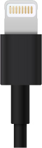

# smaho-jyuden

## 差し込み口の知識はものすごく重要。
現時点では、Type-C、microUSB、Lightning(apple独自規格)が多い。アップル製品はLightningを勧める。

## Type-C

## Lightning

## microUSB

## スマホ充電の草案

1. 名前と特徴と発売日と価格帯。
2. カメラの有無。ついてる場所。
3. ラインは可能？　可能
4. OS：（Android、iOSなど）
5. 無線系: 5G対応の有無、Wi-Fi、Bluetooth、NFC、GPS。

さて、もっとも重要な所。
1. バッテリーと充電: バッテリー容量、バッテリー駆動時間、充電方法（急速充電、ワイヤレス充電など）について説明します。
2. コネクタとインターフェース: USB Type-C、3.5mmイヤホンジャック、SIMスロット、SDカードスロットなど、デバイスに搭載されているコネクタやインターフェースを紹介します。 

充電は、USB Type-Cです。ヘッドフォンは3.5mmイヤホンジャック。イヤホンジャックは標準のものです。

iPhoneの場合、Lightningについても書く。
